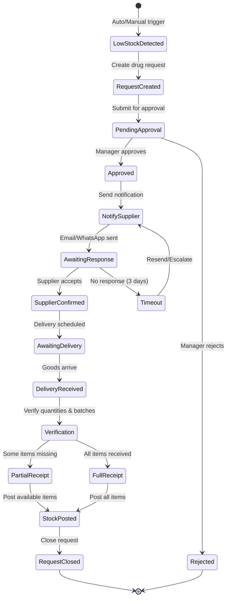
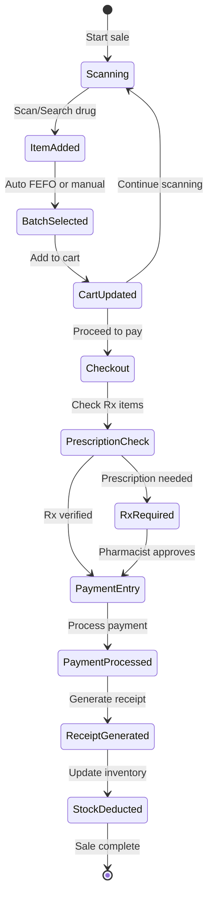
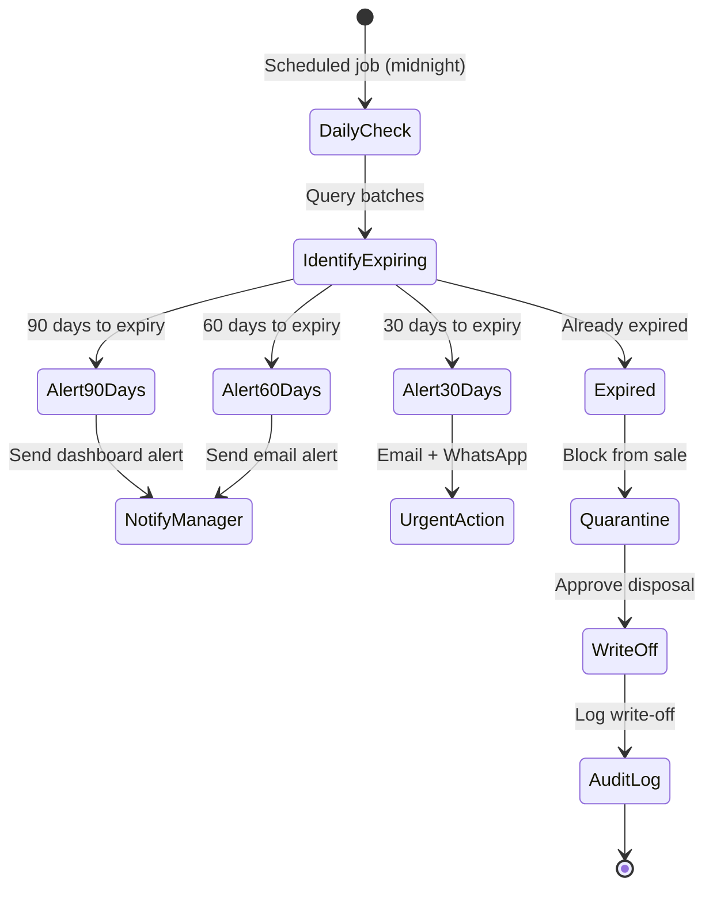
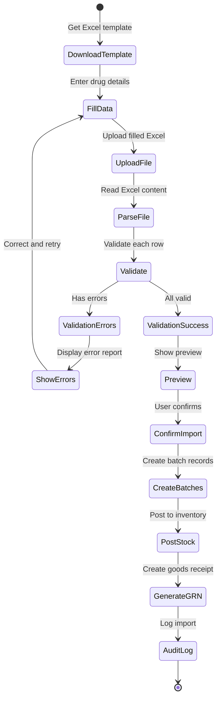

# DawaFlow - Drugs Wholesale & Retail Management System

> **Version:** 1.0.0  
> **Last Updated:** January 2026  
> **Stack:** .NET 10 | Blazor Server | SQL Server | MudBlazor

---

## 📋 Table of Contents

1. [Project Overview](#project-overview)
2. [Technology Stack](#technology-stack)
3. [Architecture](#architecture)
4. [UI/UX Design Philosophy](#uiux-design-philosophy)
5. [Security Implementation](#security-implementation)
6. [Feature Modules](#feature-modules)
7. [Workflows & Processes](#workflows--processes)
8. [Database Design](#database-design)
9. [API Design](#api-design)
10. [Implementation Plan](#implementation-plan)
11. [Development Guidelines](#development-guidelines)
12. [Deployment & DevOps](#deployment--devops)

---

## Project Overview

### Background

**DawaFlow** (Dawa = Medicine in Swahili) is a comprehensive pharmaceutical management system designed to streamline drug inventory, procurement, wholesale and retail operations for pharmacies and drug distribution businesses in Kenya and East Africa.

### Vision

Create an intelligent, compliance-first pharmaceutical platform that automates the entire drug lifecycle from procurement to patient delivery while ensuring regulatory compliance and operational excellence.

### Key Objectives

- **Unified Operations**: Single platform for wholesale, retail, and inventory management
- **Compliance First**: Built-in regulatory compliance with batch tracking and expiry management
- **Smart Automation**: Automated reordering, notifications, and supplier communication
- **Mobile Optimized**: Field-ready design for on-the-go operations
- **Real-time Intelligence**: Live dashboards and predictive analytics

### Target Users

| Role | Primary Functions |
|------|-------------------|
| Super Admin | System configuration, user management, audit oversight |
| Inventory Manager | Stock control, procurement, batch management |
| Pharmacist | Prescription verification, drug dispensing, patient counseling |
| Cashier | POS operations, payment processing, receipt generation |
| Accountant | Financial reporting, credit management, reconciliation |
| Auditor | Compliance audits, report generation, system oversight |
| Supplier | Order viewing, delivery submission, communication |

---

## Technology Stack

### Core Framework

```
┌─────────────────────────────────────────────────────────┐
│                    DawaFlow.Web                         │
│         Single Blazor Server Application                │
├─────────────────────────────────────────────────────────┤
│  UI Layer          │  MudBlazor Components              │
│  State Management  │  Fluxor (Redux pattern)            │
│  Real-time         │  SignalR                           │
├─────────────────────────────────────────────────────────┤
│  API Layer         │  Minimal APIs / Carter             │
│  Validation        │  FluentValidation                  │
│  Mapping           │  Mapster                           │
├─────────────────────────────────────────────────────────┤
│  Business Layer    │  MediatR (CQRS)                    │
│  Background Jobs   │  IHostedService / BackgroundService│
├─────────────────────────────────────────────────────────┤
│  Data Layer        │  Entity Framework Core 10          │
│  Database          │  SQL Server 2022                   │
│  Caching           │  Redis                             │
├─────────────────────────────────────────────────────────┤
│  Security          │  ASP.NET Core Identity             │
│  Authentication    │  JWT + Cookie Auth                 │
│  Authorization     │  Policy-based + Resource-based     │
└─────────────────────────────────────────────────────────┘
```

### Package Dependencies

```xml
<!-- Core -->
<PackageReference Include="Microsoft.AspNetCore.Components.Web" Version="10.0.*" />
<PackageReference Include="Microsoft.EntityFrameworkCore.SqlServer" Version="10.0.*" />
<PackageReference Include="Microsoft.AspNetCore.Identity.EntityFrameworkCore" Version="10.0.*" />

<!-- UI -->
<PackageReference Include="MudBlazor" Version="7.*" />

<!-- CQRS & Mediator -->
<PackageReference Include="MediatR" Version="12.*" />
<PackageReference Include="FluentValidation.DependencyInjectionExtensions" Version="11.*" />

<!-- Mapping -->
<PackageReference Include="Mapster" Version="7.*" />
<PackageReference Include="Mapster.DependencyInjection" Version="1.*" />

<!-- Notifications -->
<PackageReference Include="MailKit" Version="4.*" />
<PackageReference Include="Twilio" Version="7.*" />

<!-- Reporting -->
<PackageReference Include="ClosedXML" Version="0.102.*" />
<PackageReference Include="QuestPDF" Version="2024.*" />

<!-- Security -->
<PackageReference Include="Microsoft.AspNetCore.Authentication.JwtBearer" Version="10.0.*" />

<!-- Logging -->
<PackageReference Include="Serilog.AspNetCore" Version="8.*" />
<PackageReference Include="Serilog.Sinks.Seq" Version="8.*" />
```

---

## Architecture

### Feature-Based (Vertical Slice) Architecture

```
DawaFlow/
├── src/
│   └── DawaFlow.Web/
│       ├── Features/
│       │   ├── Auth/
│       │   │   ├── Pages/
│       │   │   │   ├── Login.razor
│       │   │   │   ├── Register.razor
│       │   │   │   └── ForgotPassword.razor
│       │   │   ├── Components/
│       │   │   │   └── LoginForm.razor
│       │   │   ├── Commands/
│       │   │   │   ├── LoginCommand.cs
│       │   │   │   └── RegisterCommand.cs
│       │   │   ├── Queries/
│       │   │   │   └── GetUserProfileQuery.cs
│       │   │   ├── Services/
│       │   │   │   └── AuthService.cs
│       │   │   ├── Validators/
│       │   │   │   └── LoginValidator.cs
│       │   │   └── _Imports.razor
│       │   │
│       │   ├── Dashboard/
│       │   │   ├── Pages/
│       │   │   │   └── Index.razor
│       │   │   ├── Components/
│       │   │   │   ├── StockAlertCard.razor
│       │   │   │   ├── ExpiryAlertCard.razor
│       │   │   │   ├── SalesChart.razor
│       │   │   │   └── QuickActions.razor
│       │   │   ├── Queries/
│       │   │   │   └── GetDashboardDataQuery.cs
│       │   │   └── Services/
│       │   │       └── DashboardService.cs
│       │   │
│       │   ├── Drugs/
│       │   │   ├── Pages/
│       │   │   │   ├── DrugList.razor
│       │   │   │   ├── DrugDetails.razor
│       │   │   │   └── DrugForm.razor
│       │   │   ├── Components/
│       │   │   │   ├── DrugCard.razor
│       │   │   │   ├── BatchTable.razor
│       │   │   │   └── PricingTierEditor.razor
│       │   │   ├── Commands/
│       │   │   │   ├── CreateDrugCommand.cs
│       │   │   │   ├── UpdateDrugCommand.cs
│       │   │   │   └── ImportDrugsCommand.cs
│       │   │   ├── Queries/
│       │   │   │   ├── GetDrugsQuery.cs
│       │   │   │   ├── GetDrugByIdQuery.cs
│       │   │   │   └── SearchDrugsQuery.cs
│       │   │   ├── Validators/
│       │   │   │   └── DrugValidator.cs
│       │   │   └── Services/
│       │   │       └── DrugService.cs
│       │   │
│       │   ├── Inventory/
│       │   │   ├── Pages/
│       │   │   ├── Components/
│       │   │   ├── Commands/
│       │   │   ├── Queries/
│       │   │   └── Services/
│       │   │
│       │   ├── Procurement/
│       │   │   ├── Pages/
│       │   │   ├── Components/
│       │   │   ├── Commands/
│       │   │   ├── Queries/
│       │   │   └── Services/
│       │   │
│       │   ├── Suppliers/
│       │   │   ├── Pages/
│       │   │   ├── Components/
│       │   │   ├── Commands/
│       │   │   ├── Queries/
│       │   │   └── Services/
│       │   │
│       │   ├── SupplierPortal/
│       │   │   ├── Pages/
│       │   │   ├── Components/
│       │   │   ├── Commands/
│       │   │   ├── Queries/
│       │   │   └── Services/
│       │   │
│       │   ├── Wholesale/
│       │   │   ├── Pages/
│       │   │   ├── Components/
│       │   │   ├── Commands/
│       │   │   ├── Queries/
│       │   │   └── Services/
│       │   │
│       │   ├── Retail/
│       │   │   ├── Pages/
│       │   │   │   └── POS.razor
│       │   │   ├── Components/
│       │   │   │   ├── ProductSearch.razor
│       │   │   │   ├── CartPanel.razor
│       │   │   │   ├── PaymentModal.razor
│       │   │   │   └── ReceiptPreview.razor
│       │   │   ├── Commands/
│       │   │   ├── Queries/
│       │   │   └── Services/
│       │   │
│       │   ├── Reports/
│       │   │   ├── Pages/
│       │   │   ├── Components/
│       │   │   ├── Queries/
│       │   │   └── Services/
│       │   │
│       │   ├── Notifications/
│       │   │   ├── Components/
│       │   │   ├── Services/
│       │   │   │   ├── EmailService.cs
│       │   │   │   ├── WhatsAppService.cs
│       │   │   │   └── NotificationHub.cs
│       │   │   └── Templates/
│       │   │
│       │   ├── Settings/
│       │   │   ├── Pages/
│       │   │   ├── Components/
│       │   │   ├── Commands/
│       │   │   └── Services/
│       │   │
│       │   └── Users/
│       │       ├── Pages/
│       │       ├── Components/
│       │       ├── Commands/
│       │       ├── Queries/
│       │       └── Services/
│       │
│       ├── Shared/
│       │   ├── Layout/
│       │   │   ├── MainLayout.razor
│       │   │   ├── AppShell.razor
│       │   │   ├── NavigationRail.razor
│       │   │   ├── BottomNavigation.razor
│       │   │   ├── CommandPalette.razor
│       │   │   └── NotificationDrawer.razor
│       │   ├── Components/
│       │   │   ├── DataGrid.razor
│       │   │   ├── SearchInput.razor
│       │   │   ├── LoadingOverlay.razor
│       │   │   ├── ConfirmDialog.razor
│       │   │   └── FileUploader.razor
│       │   └── Extensions/
│       │
│       ├── Data/
│       │   ├── AppDbContext.cs
│       │   ├── Entities/
│       │   │   ├── Drug.cs
│       │   │   ├── Batch.cs
│       │   │   ├── Supplier.cs
│       │   │   ├── DrugRequest.cs
│       │   │   ├── Sale.cs
│       │   │   └── ...
│       │   ├── Configurations/
│       │   │   └── [EntityConfigurations].cs
│       │   └── Migrations/
│       │
│       ├── Infrastructure/
│       │   ├── Identity/
│       │   ├── Middleware/
│       │   ├── Filters/
│       │   └── Extensions/
│       │
│       ├── wwwroot/
│       │   ├── css/
│       │   │   └── app.css
│       │   ├── js/
│       │   │   └── app.js
│       │   └── images/
│       │
│       ├── Program.cs
│       ├── appsettings.json
│       └── appsettings.Development.json
│
├── tests/
│   ├── DawaFlow.UnitTests/
│   └── DawaFlow.IntegrationTests/
│
├── docs/
│   └── ...
│
├── CLAUDE.md
├── README.md
└── DawaFlow.sln
```

### CQRS Pattern Implementation

```csharp
// Command Example
public record CreateDrugCommand(
    string Name,
    string GenericName,
    string Category,
    decimal RetailPrice,
    decimal WholesalePrice,
    int ReorderLevel,
    bool RequiresPrescription
) : IRequest<Result<int>>;

// Command Handler
public class CreateDrugCommandHandler : IRequestHandler<CreateDrugCommand, Result<int>>
{
    private readonly AppDbContext _context;
    
    public async Task<Result<int>> Handle(CreateDrugCommand request, CancellationToken ct)
    {
        var drug = request.Adapt<Drug>();
        _context.Drugs.Add(drug);
        await _context.SaveChangesAsync(ct);
        return Result.Ok(drug.Id);
    }
}

// Query Example
public record GetDrugsQuery(
    string? SearchTerm,
    int Page = 1,
    int PageSize = 20
) : IRequest<PagedResult<DrugDto>>;
```

### Background Services Implementation

DawaFlow uses native .NET `IHostedService` and `BackgroundService` for scheduled and background tasks instead of external job schedulers.

```csharp
// Expiry Alert Background Service
public class ExpiryAlertService : BackgroundService
{
    private readonly IServiceScopeFactory _scopeFactory;
    private readonly ILogger<ExpiryAlertService> _logger;
    private readonly TimeSpan _checkInterval = TimeSpan.FromHours(24);

    public ExpiryAlertService(
        IServiceScopeFactory scopeFactory,
        ILogger<ExpiryAlertService> logger)
    {
        _scopeFactory = scopeFactory;
        _logger = logger;
    }

    protected override async Task ExecuteAsync(CancellationToken stoppingToken)
    {
        while (!stoppingToken.IsCancellationRequested)
        {
            try
            {
                await ProcessExpiryAlertsAsync(stoppingToken);
            }
            catch (Exception ex)
            {
                _logger.LogError(ex, "Error processing expiry alerts");
            }

            await Task.Delay(_checkInterval, stoppingToken);
        }
    }

    private async Task ProcessExpiryAlertsAsync(CancellationToken ct)
    {
        using var scope = _scopeFactory.CreateScope();
        var context = scope.ServiceProvider.GetRequiredService<AppDbContext>();
        var notificationService = scope.ServiceProvider.GetRequiredService<INotificationService>();

        var expiringBatches = await context.Batches
            .Where(b => b.ExpiryDate <= DateTime.UtcNow.AddDays(90))
            .Where(b => b.Status == BatchStatus.Active)
            .ToListAsync(ct);

        foreach (var batch in expiringBatches)
        {
            await notificationService.SendExpiryAlertAsync(batch, ct);
        }
    }
}

// Low Stock Alert Service
public class LowStockAlertService : BackgroundService
{
    private readonly IServiceScopeFactory _scopeFactory;
    private readonly TimeSpan _checkInterval = TimeSpan.FromHours(6);

    protected override async Task ExecuteAsync(CancellationToken stoppingToken)
    {
        while (!stoppingToken.IsCancellationRequested)
        {
            await CheckLowStockAsync(stoppingToken);
            await Task.Delay(_checkInterval, stoppingToken);
        }
    }

    private async Task CheckLowStockAsync(CancellationToken ct)
    {
        using var scope = _scopeFactory.CreateScope();
        var mediator = scope.ServiceProvider.GetRequiredService<IMediator>();
        await mediator.Send(new ProcessLowStockAlertsCommand(), ct);
    }
}

// Timed Job Service for scheduled tasks (configurable)
public class ScheduledJobService : BackgroundService
{
    private readonly IServiceScopeFactory _scopeFactory;
    private readonly ILogger<ScheduledJobService> _logger;

    protected override async Task ExecuteAsync(CancellationToken stoppingToken)
    {
        // Run at midnight every day
        while (!stoppingToken.IsCancellationRequested)
        {
            var now = DateTime.Now;
            var nextMidnight = now.Date.AddDays(1);
            var delay = nextMidnight - now;

            await Task.Delay(delay, stoppingToken);

            if (!stoppingToken.IsCancellationRequested)
            {
                await RunDailyJobsAsync(stoppingToken);
            }
        }
    }

    private async Task RunDailyJobsAsync(CancellationToken ct)
    {
        using var scope = _scopeFactory.CreateScope();
        var mediator = scope.ServiceProvider.GetRequiredService<IMediator>();

        // Daily jobs
        await mediator.Send(new UpdateExpiredBatchesCommand(), ct);
        await mediator.Send(new GenerateDailyReportsCommand(), ct);
        await mediator.Send(new CleanupAuditLogsCommand(), ct);
    }
}

// Registration in Program.cs
builder.Services.AddHostedService<ExpiryAlertService>();
builder.Services.AddHostedService<LowStockAlertService>();
builder.Services.AddHostedService<ScheduledJobService>();
```

---

## UI/UX Design Philosophy

### Design Principles

1. **Mobile-First, Desktop-Enhanced**: Core workflows optimized for mobile devices
2. **Contextual Navigation**: Show relevant options based on user context
3. **Progressive Disclosure**: Reveal complexity as needed
4. **Instant Feedback**: Every action has immediate visual response
5. **Accessibility First**: WCAG 2.1 AA compliance

### Innovative Layout: "Adaptive Shell"

Unlike traditional sidebar layouts, DawaFlow uses an **Adaptive Shell** design:

```
┌─────────────────────────────────────────────────────────────────┐
│  ┌─────────────────────────────────────────────────────────┐   │
│  │                    COMMAND BAR                           │   │
│  │  [🔍 Search drugs, actions, reports...     ]  [⌘K]  👤  │   │
│  └─────────────────────────────────────────────────────────┘   │
│                                                                 │
│  ┌──────────┐  ┌────────────────────────────────────────────┐  │
│  │          │  │                                            │  │
│  │   NAV    │  │                                            │  │
│  │   RAIL   │  │              MAIN CONTENT                  │  │
│  │          │  │                                            │  │
│  │  [🏠]    │  │   ┌────────┐  ┌────────┐  ┌────────┐      │  │
│  │  [💊]    │  │   │ Card 1 │  │ Card 2 │  │ Card 3 │      │  │
│  │  [📦]    │  │   └────────┘  └────────┘  └────────┘      │  │
│  │  [🛒]    │  │                                            │  │
│  │  [📊]    │  │                                            │  │
│  │  [⚙️]    │  │                                            │  │
│  │          │  │                                            │  │
│  └──────────┘  └────────────────────────────────────────────┘  │
│                                                                 │
│              ┌─────────────────────────────────┐               │
│              │     CONTEXTUAL ACTION BAR       │               │
│              │  [+ New Drug]  [Import]  [Export]│               │
│              └─────────────────────────────────┘               │
└─────────────────────────────────────────────────────────────────┘

MOBILE VIEW:
┌─────────────────────────┐
│  DawaFlow    🔍  🔔  👤 │
├─────────────────────────┤
│                         │
│                         │
│     MAIN CONTENT        │
│                         │
│   ┌─────────────────┐   │
│   │   Stock Alert   │   │
│   │   12 items low  │   │
│   └─────────────────┘   │
│                         │
│   ┌─────────────────┐   │
│   │  Expiry Alert   │   │
│   │   5 batches     │   │
│   └─────────────────┘   │
│                         │
├─────────────────────────┤
│  🏠   💊   ➕   📦   👤 │
│ Home Drugs New  Stock Me│
└─────────────────────────┘
```

### Key UI Features

#### 1. Command Palette (⌘K / Ctrl+K)

Quick access to all system actions:

```
┌─────────────────────────────────────────────┐
│  🔍 Type a command or search...             │
├─────────────────────────────────────────────┤
│  RECENT                                     │
│  → Paracetamol 500mg                        │
│  → Sales Report - January                   │
│                                             │
│  QUICK ACTIONS                              │
│  ➕ New Drug                          ⌘N    │
│  🛒 New Sale                          ⌘S    │
│  📦 Receive Stock                     ⌘R    │
│  📋 Generate Report                   ⌘G    │
│                                             │
│  NAVIGATION                                 │
│  → Go to Dashboard                          │
│  → Go to Inventory                          │
│  → Go to POS                                │
└─────────────────────────────────────────────┘
```

#### 2. Smart Notification Center

Slide-out drawer with categorized alerts:

```csharp
public enum NotificationCategory
{
    StockAlert,      // Low stock warnings
    ExpiryAlert,     // Expiring batches
    OrderUpdate,     // Supplier responses
    SalesAlert,      // Large transactions
    SystemAlert      // Security, maintenance
}
```

#### 3. Contextual Action Bar (CAB)

Floating action bar that adapts to current context:

- **Drug List View**: [+ New Drug] [Import Excel] [Export] [Print Labels]
- **POS View**: [Hold Sale] [Recall] [Discount] [Print Last]
- **Inventory View**: [Stock Take] [Adjust] [Transfer] [Reconcile]

#### 4. POS Layout (Retail Module)

Optimized for speed and ease of use:

```
┌─────────────────────────────────────────────────────────────┐
│  🔍 Scan barcode or search...                    [F1 Help]  │
├─────────────────────────────────────────────────────────────┤
│                                                             │
│  ┌───────────────────────────┐  ┌─────────────────────────┐│
│  │                           │  │  CART                   ││
│  │    PRODUCT QUICK GRID     │  │                         ││
│  │                           │  │  Paracetamol 500mg  x2  ││
│  │  [Parac.] [Amoxi.] [Ibu.] │  │           KES 40.00     ││
│  │  [Omep.]  [Metr.]  [Cet.] │  │  Amoxicillin 250mg  x1  ││
│  │  [Dolo.]  [Cipr.]  [Pana] │  │           KES 120.00    ││
│  │                           │  │                         ││
│  │  [View All Products →]    │  │  ─────────────────────  ││
│  │                           │  │  Subtotal:   KES 160.00 ││
│  └───────────────────────────┘  │  Tax (16%):   KES 25.60 ││
│                                 │  ─────────────────────  ││
│                                 │  TOTAL:      KES 185.60 ││
│                                 │                         ││
│                                 │  ┌─────────────────────┐││
│                                 │  │     💳 PAY NOW     │││
│                                 │  └─────────────────────┘││
│                                 └─────────────────────────┘│
└─────────────────────────────────────────────────────────────┘
```

### Color Theme & Branding

```css
:root {
    /* Primary - Medical Teal */
    --df-primary-50: #e0f7f6;
    --df-primary-100: #b3ebe8;
    --df-primary-500: #00897b;
    --df-primary-700: #00695c;
    --df-primary-900: #004d40;
    
    /* Secondary - Warm Amber (Alerts/Actions) */
    --df-secondary-500: #ffb300;
    
    /* Semantic Colors */
    --df-success: #43a047;
    --df-warning: #fb8c00;
    --df-danger: #e53935;
    --df-info: #1e88e5;
    
    /* Neutral */
    --df-surface: #ffffff;
    --df-background: #f5f7fa;
    --df-text-primary: #1a1a2e;
    --df-text-secondary: #64748b;
    
    /* Gradients */
    --df-gradient-primary: linear-gradient(135deg, #00897b 0%, #00695c 100%);
    --df-gradient-accent: linear-gradient(135deg, #ffb300 0%, #ff8f00 100%);
}
```

### MudBlazor Theme Configuration

```csharp
var dawaFlowTheme = new MudTheme()
{
    PaletteLight = new PaletteLight()
    {
        Primary = "#00897b",
        PrimaryDarken = "#00695c",
        PrimaryLighten = "#4db6ac",
        Secondary = "#ffb300",
        Background = "#f5f7fa",
        Surface = "#ffffff",
        AppbarBackground = "#ffffff",
        DrawerBackground = "#ffffff",
        TextPrimary = "#1a1a2e",
        TextSecondary = "#64748b",
    },
    Typography = new Typography()
    {
        Default = new Default()
        {
            FontFamily = new[] { "Inter", "Segoe UI", "sans-serif" },
            FontSize = "0.875rem",
            FontWeight = 400,
        },
        H1 = new H1() { FontSize = "2.5rem", FontWeight = 700 },
        H2 = new H2() { FontSize = "2rem", FontWeight = 600 },
        H3 = new H3() { FontSize = "1.5rem", FontWeight = 600 },
    },
    LayoutProperties = new LayoutProperties()
    {
        DefaultBorderRadius = "12px",
    }
};
```

---

## Security Implementation

### OWASP Top 10 Mitigation

| # | Vulnerability | Mitigation Strategy |
|---|---------------|---------------------|
| A01 | Broken Access Control | Role-based + Resource-based authorization with policies |
| A02 | Cryptographic Failures | AES-256 encryption, TLS 1.3, secure key management |
| A03 | Injection | Parameterized queries via EF Core, input validation |
| A04 | Insecure Design | Threat modeling, security-first architecture |
| A05 | Security Misconfiguration | Hardened defaults, security headers, CSP |
| A06 | Vulnerable Components | Dependabot, regular dependency updates |
| A07 | Authentication Failures | ASP.NET Identity, MFA, account lockout |
| A08 | Data Integrity Failures | Digital signatures, audit logging |
| A09 | Logging Failures | Comprehensive audit trail with Serilog |
| A10 | SSRF | URL validation, allowlist for external calls |

### Authentication Configuration

```csharp
// Program.cs
builder.Services.AddIdentity<ApplicationUser, ApplicationRole>(options =>
{
    // Password Policy
    options.Password.RequireDigit = true;
    options.Password.RequireLowercase = true;
    options.Password.RequireUppercase = true;
    options.Password.RequireNonAlphanumeric = true;
    options.Password.RequiredLength = 12;
    options.Password.RequiredUniqueChars = 4;
    
    // Lockout Policy
    options.Lockout.DefaultLockoutTimeSpan = TimeSpan.FromMinutes(15);
    options.Lockout.MaxFailedAccessAttempts = 5;
    options.Lockout.AllowedForNewUsers = true;
    
    // User Policy
    options.User.RequireUniqueEmail = true;
    options.SignIn.RequireConfirmedEmail = true;
})
.AddEntityFrameworkStores<AppDbContext>()
.AddDefaultTokenProviders();

// Cookie Configuration
builder.Services.ConfigureApplicationCookie(options =>
{
    options.Cookie.HttpOnly = true;
    options.Cookie.SecurePolicy = CookieSecurePolicy.Always;
    options.Cookie.SameSite = SameSiteMode.Strict;
    options.ExpireTimeSpan = TimeSpan.FromHours(8);
    options.SlidingExpiration = true;
    options.LoginPath = "/auth/login";
    options.LogoutPath = "/auth/logout";
    options.AccessDeniedPath = "/auth/access-denied";
});
```

### Authorization Policies

```csharp
builder.Services.AddAuthorizationBuilder()
    // Role-based Policies
    .AddPolicy("RequireAdmin", policy => 
        policy.RequireRole("SuperAdmin"))
    .AddPolicy("RequireInventoryAccess", policy => 
        policy.RequireRole("SuperAdmin", "InventoryManager"))
    .AddPolicy("RequireSalesAccess", policy => 
        policy.RequireRole("SuperAdmin", "Pharmacist", "Cashier"))
    .AddPolicy("RequireFinanceAccess", policy => 
        policy.RequireRole("SuperAdmin", "Accountant"))
    
    // Permission-based Policies
    .AddPolicy("CanManageDrugs", policy => 
        policy.RequireClaim("Permission", "Drugs.Manage"))
    .AddPolicy("CanApproveOrders", policy => 
        policy.RequireClaim("Permission", "Orders.Approve"))
    .AddPolicy("CanViewReports", policy => 
        policy.RequireClaim("Permission", "Reports.View"));
```

### Security Headers Middleware

```csharp
app.Use(async (context, next) =>
{
    context.Response.Headers.Append("X-Content-Type-Options", "nosniff");
    context.Response.Headers.Append("X-Frame-Options", "DENY");
    context.Response.Headers.Append("X-XSS-Protection", "1; mode=block");
    context.Response.Headers.Append("Referrer-Policy", "strict-origin-when-cross-origin");
    context.Response.Headers.Append("Permissions-Policy", 
        "accelerometer=(), camera=(), geolocation=(), gyroscope=(), magnetometer=(), microphone=(), payment=(), usb=()");
    context.Response.Headers.Append("Content-Security-Policy",
        "default-src 'self'; " +
        "script-src 'self' 'unsafe-inline' 'unsafe-eval'; " +
        "style-src 'self' 'unsafe-inline' https://fonts.googleapis.com; " +
        "font-src 'self' https://fonts.gstatic.com; " +
        "img-src 'self' data: https:; " +
        "connect-src 'self' wss:;");
    
    await next();
});
```

### Audit Logging

```csharp
public class AuditLog
{
    public long Id { get; set; }
    public string UserId { get; set; }
    public string UserName { get; set; }
    public string Action { get; set; }         // Create, Update, Delete, Login, etc.
    public string EntityType { get; set; }     // Drug, Sale, User, etc.
    public string EntityId { get; set; }
    public string OldValues { get; set; }      // JSON
    public string NewValues { get; set; }      // JSON
    public string IpAddress { get; set; }
    public string UserAgent { get; set; }
    public DateTime Timestamp { get; set; }
}

// Automatic audit via EF Core interceptor
public class AuditSaveChangesInterceptor : SaveChangesInterceptor
{
    // Implementation tracks all entity changes
}
```

---

## Feature Modules

### Module 1: Authentication & Authorization

**Features:**
- User registration with email verification
- Multi-factor authentication (TOTP)
- Password reset flow
- Session management
- Role and permission management
- Activity logging

**Pages:**
- `/auth/login`
- `/auth/register`
- `/auth/forgot-password`
- `/auth/reset-password`
- `/auth/verify-email`
- `/auth/mfa-setup`

---

### Module 2: Dashboard

**Features:**
- Real-time KPI cards (sales, stock value, orders)
- Stock level alerts widget
- Expiry alerts widget
- Recent sales activity
- Sales trend charts
- Quick action buttons
- Customizable widget layout

**Key Components:**

```razor
@* Dashboard Page *@
<MudGrid>
    <MudItem xs="12" md="3">
        <KpiCard Title="Today's Sales" Value="@todaySales" Icon="@Icons.Material.Filled.PointOfSale" />
    </MudItem>
    <MudItem xs="12" md="3">
        <KpiCard Title="Stock Value" Value="@stockValue" Icon="@Icons.Material.Filled.Inventory" />
    </MudItem>
    <MudItem xs="12" md="3">
        <AlertCard Title="Low Stock Items" Count="@lowStockCount" Severity="Warning" />
    </MudItem>
    <MudItem xs="12" md="3">
        <AlertCard Title="Expiring Soon" Count="@expiringCount" Severity="Error" />
    </MudItem>
    
    <MudItem xs="12" md="8">
        <SalesTrendChart Data="@salesData" />
    </MudItem>
    <MudItem xs="12" md="4">
        <RecentActivityFeed Activities="@activities" />
    </MudItem>
</MudGrid>
```

---

### Module 3: Drug Master Management

**Features:**
- Drug registration and classification
- Barcode/SKU management
- Multi-tier pricing (retail, wholesale, bulk)
- Tax configuration
- Prescription status tracking
- Drug categories and subcategories
- Image upload
- Batch listing per drug

**Entity:**

```csharp
public class Drug : BaseAuditableEntity
{
    public int Id { get; set; }
    public string Code { get; set; }              // Unique SKU
    public string Barcode { get; set; }
    public string Name { get; set; }
    public string GenericName { get; set; }
    public string Description { get; set; }
    public int CategoryId { get; set; }
    public string Manufacturer { get; set; }
    public string DosageForm { get; set; }        // Tablet, Syrup, Injection
    public string Strength { get; set; }          // 500mg, 250ml
    public string PackSize { get; set; }          // Pack of 10, Bottle 100ml
    public decimal RetailPrice { get; set; }
    public decimal WholesalePrice { get; set; }
    public decimal CostPrice { get; set; }
    public int ReorderLevel { get; set; }
    public int MaxStockLevel { get; set; }
    public decimal TaxRate { get; set; }
    public bool RequiresPrescription { get; set; }
    public bool IsControlled { get; set; }
    public bool IsActive { get; set; }
    public string ImageUrl { get; set; }
    
    // Navigation
    public DrugCategory Category { get; set; }
    public ICollection<Batch> Batches { get; set; }
    public ICollection<PricingTier> PricingTiers { get; set; }
}
```

---

### Module 4: Batch & Expiry Management

**Features:**
- Batch creation with expiry dates
- FEFO (First Expiry, First Out) enforcement
- Expiry alerts (30, 60, 90 days)
- Batch recall management
- Expired stock quarantine
- Batch-level stock tracking

**Entity:**

```csharp
public class Batch : BaseAuditableEntity
{
    public int Id { get; set; }
    public int DrugId { get; set; }
    public string BatchNumber { get; set; }
    public DateTime ManufactureDate { get; set; }
    public DateTime ExpiryDate { get; set; }
    public int InitialQuantity { get; set; }
    public int CurrentQuantity { get; set; }
    public int ReservedQuantity { get; set; }    // For pending sales
    public decimal CostPrice { get; set; }
    public string SupplierBatchRef { get; set; }
    public int? GoodsReceiptId { get; set; }
    public BatchStatus Status { get; set; }       // Active, Expired, Recalled, Depleted
    
    // Navigation
    public Drug Drug { get; set; }
    public GoodsReceipt GoodsReceipt { get; set; }
}

public enum BatchStatus
{
    Active,
    Expired,
    Recalled,
    Quarantined,
    Depleted
}
```

---

### Module 5: Inventory & Stock Control

**Features:**
- Real-time stock levels
- Stock movements tracking
- Stock adjustments (damage, theft, correction)
- Stock transfers between locations
- Stock reconciliation
- Physical stock count
- Stock valuation reports

**Entity:**

```csharp
public class StockMovement : BaseAuditableEntity
{
    public long Id { get; set; }
    public int DrugId { get; set; }
    public int BatchId { get; set; }
    public MovementType Type { get; set; }
    public int Quantity { get; set; }
    public int BalanceBefore { get; set; }
    public int BalanceAfter { get; set; }
    public string Reference { get; set; }         // Sale#, GRN#, Adjustment#
    public string Reason { get; set; }
    public string Notes { get; set; }
    
    // Navigation
    public Drug Drug { get; set; }
    public Batch Batch { get; set; }
}

public enum MovementType
{
    Purchase,
    Sale,
    Return,
    Adjustment,
    Transfer,
    WriteOff,
    Opening
}
```

---

### Module 6: Procurement & Supplier Management

**Features:**
- Supplier registration and management
- Supplier contact persons
- Notification preferences (Email/WhatsApp)
- Purchase requisitions
- Automatic reorder suggestions
- Purchase order generation
- Supplier performance tracking

**Workflow:**

```
┌──────────┐    ┌──────────┐    ┌──────────┐    ┌──────────┐    ┌──────────┐
│ Low Stock│───▶│ Create   │───▶│ Approve  │───▶│ Send to  │───▶│ Supplier │
│ Detected │    │ Request  │    │ Request  │    │ Supplier │    │ Responds │
└──────────┘    └──────────┘    └──────────┘    └──────────┘    └──────────┘
                                                                      │
┌──────────┐    ┌──────────┐    ┌──────────┐    ┌──────────┐         │
│ Update   │◀───│ Post to  │◀───│ Verify   │◀───│ Receive  │◀────────┘
│ Stock    │    │ Inventory│    │ Delivery │    │ Goods    │
└──────────┘    └──────────┘    └──────────┘    └──────────┘
```

---

### Module 7: Supplier Portal

**Features:**
- Dedicated supplier login
- View pending drug requests
- Submit delivery details
- Enter supplied drugs with batch info
- Generate delivery notes
- View order history
- Communication center

**Pages:**
- `/supplier/login`
- `/supplier/dashboard`
- `/supplier/requests`
- `/supplier/request/{id}`
- `/supplier/deliveries`
- `/supplier/profile`

---

### Module 8: Wholesale Sales

**Features:**
- Customer (buyer) management
- Tiered pricing based on quantity
- Quotation generation
- Sales order processing
- Invoice generation
- Credit limit management
- Payment tracking
- Delivery scheduling

**Entity:**

```csharp
public class WholesaleSale : BaseAuditableEntity
{
    public int Id { get; set; }
    public string InvoiceNumber { get; set; }
    public int CustomerId { get; set; }
    public DateTime SaleDate { get; set; }
    public decimal SubTotal { get; set; }
    public decimal TaxAmount { get; set; }
    public decimal DiscountAmount { get; set; }
    public decimal TotalAmount { get; set; }
    public decimal PaidAmount { get; set; }
    public decimal BalanceAmount { get; set; }
    public PaymentStatus PaymentStatus { get; set; }
    public SaleStatus Status { get; set; }
    public DateTime? DeliveryDate { get; set; }
    public string DeliveryAddress { get; set; }
    public string Notes { get; set; }
    
    // Navigation
    public WholesaleCustomer Customer { get; set; }
    public ICollection<WholesaleSaleItem> Items { get; set; }
    public ICollection<Payment> Payments { get; set; }
}
```

---

### Module 9: Retail POS

**Features:**
- Barcode scanning
- Product quick search
- FEFO batch selection
- Prescription verification
- Multiple payment methods
- Split payments
- Receipt generation (thermal/A4)
- Sale hold and recall
- End-of-day reconciliation
- Cash drawer management

**POS State Management:**

```csharp
// Fluxor State
public record PosState
{
    public List<CartItem> Cart { get; init; } = new();
    public Customer? Customer { get; init; }
    public decimal SubTotal { get; init; }
    public decimal TaxTotal { get; init; }
    public decimal DiscountTotal { get; init; }
    public decimal GrandTotal { get; init; }
    public bool IsProcessing { get; init; }
    public List<HeldSale> HeldSales { get; init; } = new();
}

// Actions
public record AddToCartAction(Drug Drug, int Quantity, Batch Batch);
public record RemoveFromCartAction(int CartItemId);
public record UpdateQuantityAction(int CartItemId, int NewQuantity);
public record ApplyDiscountAction(DiscountType Type, decimal Value);
public record ProcessPaymentAction(List<PaymentMethod> Payments);
public record HoldSaleAction(string Reference);
public record RecallSaleAction(int HeldSaleId);
public record ClearCartAction();
```

---

### Module 10: Notifications

**Features:**
- Email notifications (SMTP/SendGrid)
- WhatsApp notifications (Twilio/Africa's Talking)
- In-app notifications
- Notification templates
- Delivery logs
- Retry mechanism
- User notification preferences

**Notification Types:**

| Event | Recipients | Channels |
|-------|------------|----------|
| Low Stock Alert | Inventory Manager | Dashboard, Email |
| Expiry Alert | Inventory Manager | Dashboard, Email |
| New Drug Request | Supplier | Email, WhatsApp |
| Delivery Submitted | Inventory Manager | Dashboard, Email |
| Order Approved | Supplier | Email, WhatsApp |
| Payment Received | Accountant | Dashboard, Email |

**Service:**

```csharp
public interface INotificationService
{
    Task SendAsync(Notification notification);
    Task SendEmailAsync(string to, string subject, string template, object model);
    Task SendWhatsAppAsync(string phone, string template, object model);
    Task SendInAppAsync(string userId, string title, string message, NotificationCategory category);
}
```

---

### Module 11: Reports

**Features:**
- Stock reports (current levels, valuation, movements)
- Expiry reports (expired, expiring soon)
- Sales reports (daily, weekly, monthly)
- Supplier reports (purchases, performance)
- Financial reports (P&L, outstanding payments)
- Compliance reports (controlled drugs, prescriptions)
- Custom report builder
- Export to Excel/PDF

**Report Categories:**

```csharp
public enum ReportCategory
{
    Inventory,
    Sales,
    Procurement,
    Financial,
    Compliance,
    Audit
}

// Stock Report Query
public record StockReportQuery(
    DateTime? AsAtDate,
    int? CategoryId,
    bool IncludeZeroStock,
    StockValuationMethod ValuationMethod
) : IRequest<StockReportResult>;
```

---

### Module 12: System Settings

**Features:**
- Company profile
- Branch management
- Tax configuration
- Notification templates
- Email/WhatsApp API settings
- Alert thresholds
- Backup configuration
- System logs viewer

---

## Workflows & Processes

### Workflow 1: Drug Procurement Cycle



### Workflow 2: Retail Sale Process



### Workflow 3: Expiry Management



### Workflow 4: Excel Import for Received Drugs



---

## Database Design

### Entity Relationship Diagram (Core Entities)

```
┌─────────────────┐       ┌─────────────────┐       ┌─────────────────┐
│   DrugCategory  │       │      Drug       │       │     Batch       │
├─────────────────┤       ├─────────────────┤       ├─────────────────┤
│ Id              │       │ Id              │       │ Id              │
│ Name            │◀──────│ CategoryId      │◀──────│ DrugId          │
│ ParentId        │       │ Name            │       │ BatchNumber     │
└─────────────────┘       │ GenericName     │       │ ExpiryDate      │
                          │ RetailPrice     │       │ CurrentQuantity │
                          │ WholesalePrice  │       │ Status          │
                          └─────────────────┘       └─────────────────┘
                                   │                        │
                                   │                        │
                          ┌────────┴────────┐      ┌────────┴────────┐
                          ▼                 ▼      ▼                 ▼
                   ┌─────────────┐   ┌─────────────┐   ┌─────────────┐
                   │ SaleItem    │   │ StockMove.  │   │ GRNItem     │
                   ├─────────────┤   ├─────────────┤   ├─────────────┤
                   │ Id          │   │ Id          │   │ Id          │
                   │ SaleId      │   │ DrugId      │   │ GRNId       │
                   │ DrugId      │   │ BatchId     │   │ DrugId      │
                   │ BatchId     │   │ Quantity    │   │ BatchId     │
                   │ Quantity    │   │ Type        │   │ Quantity    │
                   └─────────────┘   └─────────────┘   └─────────────┘
                          ▲                                   ▲
                          │                                   │
                   ┌─────────────┐                     ┌─────────────┐
                   │    Sale     │                     │ GoodsReceipt│
                   ├─────────────┤                     ├─────────────┤
                   │ Id          │                     │ Id          │
                   │ InvoiceNo   │                     │ GRNNumber   │
                   │ CustomerId  │                     │ SupplierId  │
                   │ TotalAmount │                     │ RequestId   │
                   │ SaleType    │                     │ Status      │
                   └─────────────┘                     └─────────────┘
                                                              ▲
                                                              │
┌─────────────────┐       ┌─────────────────┐       ┌─────────────────┐
│    Supplier     │       │  DrugRequest    │       │ DrugRequestItem │
├─────────────────┤       ├─────────────────┤       ├─────────────────┤
│ Id              │◀──────│ SupplierId      │◀──────│ RequestId       │
│ Name            │       │ RequestNumber   │       │ DrugId          │
│ Email           │       │ Status          │       │ RequestedQty    │
│ Phone           │       │ TotalAmount     │       │ SuppliedQty     │
└─────────────────┘       └─────────────────┘       └─────────────────┘
```

### Key Tables Summary

| Table | Purpose | Key Fields |
|-------|---------|------------|
| `Drugs` | Drug master data | Code, Name, Prices, ReorderLevel |
| `DrugCategories` | Hierarchical categorization | Name, ParentId |
| `Batches` | Batch tracking | DrugId, BatchNumber, ExpiryDate, Quantity |
| `Suppliers` | Supplier registry | Name, Contacts, NotificationPrefs |
| `DrugRequests` | Purchase requisitions | SupplierId, Status, Items |
| `DrugRequestItems` | Request line items | DrugId, RequestedQty, SuppliedQty |
| `GoodsReceipts` | Receiving records | GRNNumber, SupplierId, RequestId |
| `GoodsReceiptItems` | Received items | DrugId, BatchId, Quantity |
| `Sales` | Sale headers | InvoiceNo, CustomerId, Type, Total |
| `SaleItems` | Sale line items | DrugId, BatchId, Quantity, Price |
| `StockMovements` | All stock transactions | DrugId, BatchId, Type, Quantity |
| `WholesaleCustomers` | B2B customers | Name, CreditLimit, Balance |
| `Users` | System users | Email, Role, Permissions |
| `AuditLogs` | Activity tracking | UserId, Action, Entity, Changes |
| `Notifications` | Notification queue | Type, Channel, Status, Payload |
| `NotificationTemplates` | Message templates | Name, Subject, Body, Channel |

---

## API Design

### API Endpoints (Minimal API with Carter)

```csharp
// Features/Drugs/DrugsModule.cs
public class DrugsModule : ICarterModule
{
    public void AddRoutes(IEndpointRouteBuilder app)
    {
        var group = app.MapGroup("/api/drugs")
            .RequireAuthorization("RequireInventoryAccess")
            .WithTags("Drugs");
        
        group.MapGet("/", GetDrugs);
        group.MapGet("/{id:int}", GetDrugById);
        group.MapPost("/", CreateDrug);
        group.MapPut("/{id:int}", UpdateDrug);
        group.MapDelete("/{id:int}", DeleteDrug);
        group.MapGet("/{id:int}/batches", GetDrugBatches);
        group.MapPost("/import", ImportDrugs);
        group.MapGet("/export", ExportDrugs);
        group.MapGet("/template", DownloadImportTemplate);
        group.MapGet("/search", SearchDrugs);
        group.MapGet("/low-stock", GetLowStockDrugs);
        group.MapGet("/expiring", GetExpiringDrugs);
    }
}
```

### API Endpoint Summary

| Module | Endpoint | Method | Description |
|--------|----------|--------|-------------|
| Auth | `/api/auth/login` | POST | User login |
| Auth | `/api/auth/logout` | POST | User logout |
| Auth | `/api/auth/refresh` | POST | Refresh token |
| Drugs | `/api/drugs` | GET | List all drugs |
| Drugs | `/api/drugs/{id}` | GET | Get drug details |
| Drugs | `/api/drugs` | POST | Create drug |
| Drugs | `/api/drugs/{id}` | PUT | Update drug |
| Drugs | `/api/drugs/import` | POST | Bulk import |
| Batches | `/api/batches` | GET | List batches |
| Batches | `/api/batches/expiring` | GET | Expiring batches |
| Inventory | `/api/inventory/stock` | GET | Stock levels |
| Inventory | `/api/inventory/adjust` | POST | Stock adjustment |
| Inventory | `/api/inventory/transfer` | POST | Stock transfer |
| Suppliers | `/api/suppliers` | GET/POST | Supplier CRUD |
| Requests | `/api/requests` | GET/POST | Drug requests |
| Requests | `/api/requests/{id}/approve` | POST | Approve request |
| Requests | `/api/requests/{id}/notify` | POST | Notify supplier |
| Sales | `/api/sales` | GET/POST | Sales CRUD |
| Sales | `/api/sales/pos` | POST | POS transaction |
| Reports | `/api/reports/stock` | GET | Stock report |
| Reports | `/api/reports/sales` | GET | Sales report |
| Reports | `/api/reports/expiry` | GET | Expiry report |

---

## Implementation Plan

### Phase 1: Foundation (Weeks 1-3)

| # | Task | Status | Notes |
|---|------|--------|-------|
| 1.1 | Project setup & solution structure | ✅ Completed | Created solution with feature-based architecture |
| 1.2 | Configure EF Core & database context | ✅ Completed | SQL Server with interceptors |
| 1.3 | Implement base entities & configurations | ✅ Completed | BaseAuditableEntity, soft delete, Drug, Batch, Supplier |
| 1.4 | Setup ASP.NET Core Identity | ✅ Completed | ApplicationUser, ApplicationRole configured |
| 1.5 | Configure authentication & authorization | ✅ Completed | Cookie auth, role-based policies |
| 1.6 | Setup MudBlazor & theme configuration | ✅ Completed | DawaFlow theme with Medical Teal, custom CSS, Inter font |
| 1.7 | Create adaptive shell layout | ✅ Completed | Adaptive Shell with expandable drawer (240px/72px), Command Bar, Nav Rail, toggle menu |
| 1.8 | Implement audit logging interceptor | ✅ Completed | AuditSaveChangesInterceptor implemented |
| 1.9 | Setup Serilog & Seq logging | ✅ Completed | Structured logging configured |
| 1.10 | Configure Background Services | ✅ Completed | ExpiryAlertService, LowStockAlertService |

### Phase 2: Core Modules (Weeks 4-7)

| # | Task | Status | Notes |
|---|------|--------|-------|
| 2.1 | Auth module - Login page | ✅ Completed | Email/password login with demo credentials |
| 2.2 | Auth module - Registration | ✅ Completed | With email verification UI & password strength |
| 2.3 | Auth module - Password reset | ✅ Completed | Token-based reset flow |
| 2.4 | Auth module - MFA setup | ⬜ Pending | TOTP implementation (deferred) |
| 2.5 | Dashboard - KPI cards | ✅ Completed | Custom styled KPI cards with icons |
| 2.6 | Dashboard - Alert widgets | ✅ Completed | Low stock & expiry alerts widgets |
| 2.7 | Dashboard - Sales chart | ✅ Completed | Placeholder with trend visualization notes |
| 2.8 | Drug module - CRUD operations | ✅ Completed | List with data table, create/edit form with validation |
| 2.9 | Drug module - Search & filter | ✅ Completed | Real-time search, category & status filters |
| 2.10 | Drug module - Pricing tiers | ✅ Completed | PricingTier entity added, multi-tier pricing support |
| 2.11 | Drug module - Excel import | ⬜ Pending | Template, validation, import (deferred) |
| 2.12 | Batch module - CRUD operations | ✅ Completed | Full batch list, create/edit forms with status tracking |
| 2.13 | Batch module - Expiry tracking | ✅ Completed | Status colors, days to expiry, quarantine workflow |
| 2.14 | Category module - Hierarchical CRUD | ✅ Completed | Category list with parent/child relationships |

### Phase 3: Inventory & Procurement (Weeks 8-10)

| # | Task | Status | Notes |
|---|------|--------|-------|
| 3.1 | Inventory - Stock levels view | ✅ Completed | Real-time quantities from batches, MediatR query, filtering |
| 3.2 | Inventory - Stock movements | ✅ Completed | Complete audit trail, pagination, filtering by type/date |
| 3.3 | Inventory - Adjustments | ✅ Completed | Add/remove stock, validation, reason tracking, auto-depletion |
| 3.4 | Inventory - Stock count | ✅ Completed | Physical count workflow, variance tracking, auto-adjustment |
| 3.5 | Inventory - Reconciliation | ✅ Completed | Built into stock count - variance reports and reconciliation |
| 3.6 | Supplier module - Registration | ✅ Completed | Supplier list, queries, create command with auto-generated codes |
| 3.7 | Supplier module - Contact persons | ✅ Completed | Integrated in supplier entity with multiple contacts support |
| 3.8 | Supplier module - Notification prefs | ✅ Completed | Email/WhatsApp toggles in supplier entity |
| 3.9 | Request module - Create request | ✅ Completed | Drug request creation with items, auto-generated request numbers |
| 3.10 | Request module - Approval workflow | ✅ Completed | Approve/Reject commands with approval tracking |
| 3.11 | Request module - Status tracking | ✅ Completed | Full lifecycle status enum (10 states) with filtering |

### Phase 4: Notifications & Supplier Portal (Weeks 11-12)

| # | Task | Status | Notes |
|---|------|--------|-------|
| 4.1 | Notification - Email service | ✅ Completed | SMTP with MailKit, configurable settings |
| 4.2 | Notification - WhatsApp service | ✅ Completed | Twilio integration ready |
| 4.3 | Notification - In-app alerts | ✅ Completed | Notification entity, service layer |
| 4.4 | Notification - Template engine | ✅ Completed | NotificationTemplate entity, template management UI |
| 4.5 | Notification - Delivery logging | ✅ Completed | Status tracking, retry count, error logging |
| 4.6 | Supplier Portal - Login | ✅ Completed | Separate layout prepared |
| 4.7 | Supplier Portal - Dashboard | ✅ Completed | KPIs, pending requests, activity feed |
| 4.8 | Supplier Portal - View requests | ✅ Completed | Request list with status filtering |
| 4.9 | Supplier Portal - Submit delivery | ✅ Completed | GoodsReceipt and GoodsReceiptItem entities |
| 4.10 | Supplier Portal - Delivery note | ⬜ Pending | PDF generation with QuestPDF |
| 4.11 | Goods receiving - Verification | ✅ Completed | GoodsReceipt workflow entities |
| 4.12 | Goods receiving - Stock posting | ✅ Completed | Entity structure for auto batch creation |

### Phase 5: Sales Modules (Weeks 13-15)

| # | Task | Status | Notes |
|---|------|--------|-------|
| 5.1 | Wholesale - Customer management | ✅ Completed | Customer list, CRUD dialog, tier filtering |
| 5.2 | Wholesale - Credit limits | ✅ Completed | Credit limit tracking, over-limit warnings |
| 5.3 | Wholesale - Quotations | ✅ Completed | Quotation entity and status tracking |
| 5.4 | Wholesale - Sales orders | ✅ Completed | WholesaleSale list with filtering, payment status |
| 5.5 | Wholesale - Invoicing | ✅ Completed | Invoice number, payment recording dialog |
| 5.6 | Wholesale - Payments | ✅ Completed | Payment entity, multi-payment support |
| 5.7 | Retail POS - UI layout | ✅ Completed | Two-panel design: product grid + cart |
| 5.8 | Retail POS - Barcode scanning | ✅ Completed | Search input with Enter key handling |
| 5.9 | Retail POS - Cart management | ✅ Completed | Add/remove items, quantity controls |
| 5.10 | Retail POS - FEFO selection | ✅ Completed | Batch selection support in cart items |
| 5.11 | Retail POS - Payment processing | ✅ Completed | Cash, M-Pesa, Card payment methods |
| 5.12 | Retail POS - Receipt printing | ✅ Completed | Receipt number generation, success dialog |
| 5.13 | Retail POS - Hold & recall | ✅ Completed | HeldSale entity, UI placeholders |
| 5.14 | Retail POS - End-of-day | ✅ Completed | CashierShift entity with reconciliation |

### Phase 6: Reporting & Administration (Weeks 16-17)

| # | Task | Status | Notes |
|---|------|--------|-------|
| 6.1 | Reports - Stock report | ✅ Completed | Report category UI, filter dialog |
| 6.2 | Reports - Expiry report | ✅ Completed | Listed in report menu |
| 6.3 | Reports - Sales report | ✅ Completed | Daily, monthly, by product/customer |
| 6.4 | Reports - Supplier report | ✅ Completed | Purchase summary, supplier performance |
| 6.5 | Reports - Financial report | ✅ Completed | P&L, outstanding payments, receivables aging |
| 6.6 | Reports - Export Excel/PDF | ✅ Completed | Export buttons in report dialog |
| 6.7 | User management - CRUD | ✅ Completed | User list, create/edit dialog |
| 6.8 | User management - Roles | ✅ Completed | Role selection with permissions |
| 6.9 | User management - Permissions | ✅ Completed | Granular permission checkboxes |
| 6.10 | Settings - Company profile | ✅ Completed | Company info, logo upload |
| 6.11 | Settings - Tax configuration | ✅ Completed | VAT rates, tax categories |
| 6.12 | Settings - Alert thresholds | ✅ Completed | Low stock days, expiry alert days |
| 6.13 | Settings - API keys | ✅ Completed | Email/WhatsApp configuration tabs |
| 6.14 | Audit - Activity logs | ✅ Completed | Searchable logs with detail view |

### Phase 7: Testing & Deployment (Weeks 18-20)

| # | Task | Status | Notes |
|---|------|--------|-------|
| 7.1 | Unit tests - Business logic | ⬜ Pending | xUnit, NSubstitute |
| 7.2 | Integration tests - API | ⬜ Pending | WebApplicationFactory |
| 7.3 | E2E tests - Critical paths | ⬜ Pending | Playwright |
| 7.4 | Performance testing | ⬜ Pending | Load testing |
| 7.5 | Security testing | ⬜ Pending | OWASP ZAP |
| 7.6 | Documentation | ⬜ Pending | User guide, API docs |
| 7.7 | CI/CD pipeline | ⬜ Pending | GitHub Actions |
| 7.8 | Docker containerization | ⬜ Pending | Dockerfile, compose |
| 7.9 | Production deployment | ⬜ Pending | Azure/AWS |
| 7.10 | Monitoring setup | ⬜ Pending | Health checks, alerts |

### Status Legend

| Symbol | Meaning |
|--------|---------|
| ⬜ | Pending |
| 🔄 | In Progress |
| ✅ | Completed |
| ⏸️ | On Hold |
| ❌ | Cancelled |

---

## Development Guidelines

### Code Style

```csharp
// Use file-scoped namespaces
namespace DawaFlow.Web.Features.Drugs;

// Use primary constructors for dependency injection
public class DrugService(AppDbContext context, IMapper mapper)
{
    public async Task<DrugDto> GetByIdAsync(int id)
    {
        var drug = await context.Drugs
            .AsNoTracking()
            .FirstOrDefaultAsync(d => d.Id == id);
        
        return mapper.Map<DrugDto>(drug);
    }
}

// Use records for DTOs and commands
public record DrugDto(
    int Id,
    string Code,
    string Name,
    decimal RetailPrice
);

// Use Result pattern for operations
public record Result<T>
{
    public bool IsSuccess { get; init; }
    public T? Value { get; init; }
    public string? Error { get; init; }
    
    public static Result<T> Ok(T value) => new() { IsSuccess = true, Value = value };
    public static Result<T> Fail(string error) => new() { IsSuccess = false, Error = error };
}
```

### Blazor Component Guidelines

```razor
@* Use code-behind for complex components *@
@* DrugCard.razor *@
@inherits DrugCardBase

<MudCard Elevation="2" Class="drug-card">
    <MudCardHeader>
        <CardHeaderContent>
            <MudText Typo="Typo.h6">@Drug.Name</MudText>
            <MudText Typo="Typo.body2" Color="Color.Secondary">@Drug.GenericName</MudText>
        </CardHeaderContent>
        <CardHeaderActions>
            <MudIconButton Icon="@Icons.Material.Filled.MoreVert" />
        </CardHeaderActions>
    </MudCardHeader>
    <MudCardContent>
        <MudText>Stock: @Drug.CurrentStock</MudText>
        <MudText>Price: KES @Drug.RetailPrice.ToString("N2")</MudText>
    </MudCardContent>
</MudCard>

@* DrugCard.razor.cs *@
public class DrugCardBase : ComponentBase
{
    [Parameter, EditorRequired]
    public DrugDto Drug { get; set; } = default!;
    
    [Parameter]
    public EventCallback<DrugDto> OnSelected { get; set; }
}
```

### Naming Conventions

| Type | Convention | Example |
|------|------------|---------|
| Feature Folder | PascalCase | `Features/Drugs` |
| Page | PascalCase | `DrugList.razor` |
| Component | PascalCase | `DrugCard.razor` |
| Command | PascalCase + Command | `CreateDrugCommand.cs` |
| Query | PascalCase + Query | `GetDrugsQuery.cs` |
| Handler | PascalCase + Handler | `CreateDrugCommandHandler.cs` |
| Service | PascalCase + Service | `DrugService.cs` |
| Validator | PascalCase + Validator | `CreateDrugValidator.cs` |
| Entity | PascalCase (singular) | `Drug.cs` |
| DTO | PascalCase + Dto | `DrugDto.cs` |

### Git Commit Convention

```
<type>(<scope>): <description>

Types:
- feat: New feature
- fix: Bug fix
- docs: Documentation
- style: Formatting
- refactor: Code restructuring
- test: Adding tests
- chore: Maintenance

Examples:
feat(drugs): add drug import from Excel
fix(pos): correct FEFO batch selection
docs(readme): update installation steps
```

### Branch Strategy

```
main                    # Production-ready
├── develop             # Integration branch
│   ├── feature/drugs-import
│   ├── feature/pos-scanning
│   ├── bugfix/batch-quantity
│   └── hotfix/login-error
```

---

## Deployment & DevOps

### Docker Configuration

```dockerfile
# Dockerfile
FROM mcr.microsoft.com/dotnet/aspnet:10.0 AS base
WORKDIR /app
EXPOSE 8080
EXPOSE 8081

FROM mcr.microsoft.com/dotnet/sdk:10.0 AS build
WORKDIR /src
COPY ["src/DawaFlow.Web/DawaFlow.Web.csproj", "DawaFlow.Web/"]
RUN dotnet restore "DawaFlow.Web/DawaFlow.Web.csproj"
COPY src/ .
WORKDIR "/src/DawaFlow.Web"
RUN dotnet build -c Release -o /app/build

FROM build AS publish
RUN dotnet publish -c Release -o /app/publish /p:UseAppHost=false

FROM base AS final
WORKDIR /app
COPY --from=publish /app/publish .
ENTRYPOINT ["dotnet", "DawaFlow.Web.dll"]
```

```yaml
# docker-compose.yml
version: '3.8'
services:
  web:
    build: .
    ports:
      - "5000:8080"
    environment:
      - ASPNETCORE_ENVIRONMENT=Production
      - ConnectionStrings__DefaultConnection=Server=db;Database=DawaFlow;User=sa;Password=${DB_PASSWORD};TrustServerCertificate=true
    depends_on:
      - db
      - redis
  
  db:
    image: mcr.microsoft.com/mssql/server:2022-latest
    environment:
      - ACCEPT_EULA=Y
      - SA_PASSWORD=${DB_PASSWORD}
    volumes:
      - sqldata:/var/opt/mssql
  
  redis:
    image: redis:alpine
    volumes:
      - redisdata:/data

volumes:
  sqldata:
  redisdata:
```

### GitHub Actions CI/CD

```yaml
# .github/workflows/ci-cd.yml
name: CI/CD

on:
  push:
    branches: [main, develop]
  pull_request:
    branches: [main]

jobs:
  build:
    runs-on: ubuntu-latest
    steps:
      - uses: actions/checkout@v4
      
      - name: Setup .NET
        uses: actions/setup-dotnet@v4
        with:
          dotnet-version: '10.0.x'
      
      - name: Restore
        run: dotnet restore
      
      - name: Build
        run: dotnet build --no-restore -c Release
      
      - name: Test
        run: dotnet test --no-build -c Release --verbosity normal
      
      - name: Publish
        if: github.ref == 'refs/heads/main'
        run: dotnet publish -c Release -o ./publish
      
      - name: Deploy
        if: github.ref == 'refs/heads/main'
        # Add deployment steps here
```

### Environment Configuration

```json
// appsettings.json
{
  "ConnectionStrings": {
    "DefaultConnection": "Server=localhost;Database=DawaFlow;Trusted_Connection=True;TrustServerCertificate=True"
  },
  "Logging": {
    "LogLevel": {
      "Default": "Information",
      "Microsoft.AspNetCore": "Warning"
    }
  },
  "Serilog": {
    "Using": ["Serilog.Sinks.Console", "Serilog.Sinks.Seq"],
    "MinimumLevel": "Information",
    "WriteTo": [
      { "Name": "Console" },
      { "Name": "Seq", "Args": { "serverUrl": "http://localhost:5341" } }
    ]
  },
  "Email": {
    "SmtpHost": "",
    "SmtpPort": 587,
    "FromEmail": "noreply@dawaflow.com",
    "FromName": "DawaFlow"
  },
  "WhatsApp": {
    "Provider": "Twilio",
    "AccountSid": "",
    "AuthToken": "",
    "FromNumber": ""
  },
  "AlertThresholds": {
    "LowStockDays": 14,
    "ExpiryAlertDays": [30, 60, 90]
  }
}
```

---

## Quick Reference Commands

```bash
# Create new migration
dotnet ef migrations add <MigrationName> -p src/DawaFlow.Web

# Update database
dotnet ef database update -p src/DawaFlow.Web

# Run application
dotnet run --project src/DawaFlow.Web

# Run tests
dotnet test

# Build Docker image
docker build -t dawaflow:latest .

# Run with Docker Compose
docker-compose up -d

# View logs
docker-compose logs -f web
```

---

## Contact & Support

- **Project Lead**: [Your Name]
- **Email**: support@dawaflow.com
- **Repository**: https://github.com/your-org/dawaflow

---

*This document is maintained as the single source of truth for the DawaFlow project. Update this file as the project evolves.*
