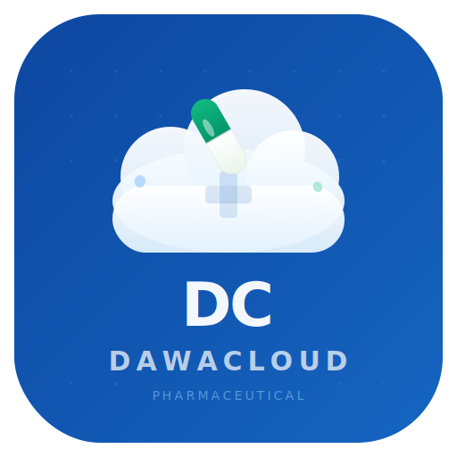

# DawaCloud - Pharmaceutical Management System

<div align="center">
  

  **DawaCloud**

  **Modern Drugs Wholesale & Retail Management System**

  *Currently deployed for Revo Pharma & Medical Ltd*
  
  [](https://dotnet.microsoft.com/)
  [](https://blazor.net/)
  [](https://mudblazor.com/)
  [](LICENSE)
</div>

---

## 📋 Overview

**DawaCloud** (Dawa = Medicine in Swahili) is a comprehensive pharmaceutical management system designed to streamline drug inventory, procurement, wholesale and retail operations for pharmacies and drug distribution businesses in South Sudan and East Africa.

### Key Features

- **🏥 Drug Management**: Complete drug master data with batch tracking and expiry management
- **📦 Inventory Control**: Real-time stock levels, movements, adjustments, and reconciliation
- **🛒 Procurement**: Automated reordering, supplier management, and purchase workflows
- **💳 Point of Sale**: Fast retail POS with barcode scanning and FEFO selection
- **📊 Wholesale**: B2B customer management, quotations, invoicing, and credit control
- **📈 Reports**: Comprehensive analytics for stock, sales, financial, and compliance reporting
- **🔔 Notifications**: Email and WhatsApp alerts for stock and expiry management
- **🔐 Security**: Role-based access control with comprehensive audit logging

---

## 🚀 Quick Start

### Prerequisites

- [.NET 10 SDK](https://dotnet.microsoft.com/download/dotnet/10.0)
- [SQL Server 2022](https://www.microsoft.com/sql-server) (or Docker)
- [Node.js 18+](https://nodejs.org/) (for frontend tooling)

### Installation

1. **Clone the repository**
   ```bash
   git clone https://github.com/your-org/DawaCloud.git
   cd DawaCloud
   ```

2. **Configure the database connection**
   
   Update `src/DawaCloud.Web/appsettings.json`:
   ```json
   {
     "ConnectionStrings": {
       "DefaultConnection": "Server=localhost;Database=DawaCloud;Trusted_Connection=True;TrustServerCertificate=True"
     }
   }
   ```

3. **Run database migrations**
   ```bash
   cd src/DawaCloud.Web
   dotnet ef database update
   ```

4. **Start the application**
   ```bash
   dotnet run
   ```

5. **Open your browser**
   
   Navigate to `https://localhost:5001`

### Demo Credentials

| Role | Email | Password |
|------|-------|----------|
| Admin | admin@DawaCloud.com | Admin@123 |
| Pharmacist | pharmacist@DawaCloud.com | Demo@123 |
| Cashier | cashier@DawaCloud.com | Demo@123 |

---

## 🏗️ Architecture

DawaCloud uses a **Feature-Based (Vertical Slice) Architecture** with CQRS pattern:

```
DawaCloud/
├── src/
│   └── DawaCloud.Web/           # Main Blazor Server Application
│       ├── Features/           # Feature modules (vertical slices)
│       │   ├── Auth/          # Authentication & Authorization
│       │   ├── Dashboard/     # Dashboard & KPIs
│       │   ├── Drugs/         # Drug management
│       │   ├── Batches/       # Batch & expiry tracking
│       │   ├── Inventory/     # Stock management
│       │   ├── Procurement/   # Drug requests & goods receiving
│       │   ├── Suppliers/     # Supplier management
│       │   ├── Wholesale/     # B2B sales & invoicing
│       │   ├── Retail/        # Point of Sale
│       │   ├── Reports/       # Analytics & reporting
│       │   ├── Notifications/ # Alert system
│       │   ├── Users/         # User management
│       │   ├── Settings/      # System configuration
│       │   └── Audit/         # Activity logging
│       ├── Data/              # Entity models & DbContext
│       ├── Infrastructure/    # Cross-cutting concerns
│       └── Shared/            # Shared components
├── tests/                     # Unit & Integration tests
└── docs/                      # Documentation
```

---

## 🛠️ Technology Stack

| Layer | Technology |
|-------|------------|
| **UI Framework** | Blazor Server |
| **Component Library** | MudBlazor 7.x |
| **Backend** | ASP.NET Core 10 |
| **Database** | SQL Server 2022 |
| **ORM** | Entity Framework Core 10 |
| **CQRS** | MediatR |
| **Validation** | FluentValidation |
| **Mapping** | Mapster |
| **Notifications** | MailKit, Twilio |
| **Reporting** | QuestPDF, ClosedXML |
| **Logging** | Serilog |

---

## 📖 Documentation

- [CLAUDE.md](CLAUDE.md) - Comprehensive project documentation and implementation status
- [API Documentation](docs/api.md) - REST API reference
- [User Guide](docs/user-guide.md) - End-user documentation
- [Deployment Guide](docs/deployment.md) - Production deployment instructions

---

## 🔧 Configuration

### Email (SMTP)
```json
{
  "Email": {
    "SmtpHost": "smtp.example.com",
    "SmtpPort": 587,
    "FromEmail": "noreply@DawaCloud.com",
    "FromName": "DawaCloud"
  }
}
```

### WhatsApp (Twilio)
```json
{
  "WhatsApp": {
    "Provider": "Twilio",
    "AccountSid": "your-account-sid",
    "AuthToken": "your-auth-token",
    "FromNumber": "+211XXXXXXXXX"
  }
}
```

### Alert Thresholds
```json
{
  "AlertThresholds": {
    "LowStockDays": 14,
    "ExpiryAlertDays": [30, 60, 90]
  }
}
```

---

## 🐳 Docker Deployment

```bash
# Build the image
docker build -t DawaCloud:latest .

# Run with Docker Compose
docker-compose up -d
```

---

## 🤝 Contributing

1. Fork the repository
2. Create a feature branch (`git checkout -b feature/amazing-feature`)
3. Commit your changes (`git commit -m 'feat: add amazing feature'`)
4. Push to the branch (`git push origin feature/amazing-feature`)
5. Open a Pull Request

---

## 📜 License

This project is licensed under the MIT License - see the [LICENSE](LICENSE) file for details.

---

## 📞 Support

- **Company**: Revo Pharma & Medical Ltd
- **Email**: info@revopharma.com
- **Website**: www.revopharma.com
- **Phone**: +211 920 123456
- **Location**: Mobil, Hai Cinema, Juba, South Sudan
- **Issues**: [GitHub Issues](https://github.com/your-org/DawaCloud/issues)

---

## 🏢 About This Installation

This DawaCloud system is currently deployed for **Revo Pharma & Medical Ltd**, a leading pharmaceutical distribution company serving South Sudan.

**About DawaCloud:**
DawaCloud is a flexible pharmaceutical management platform that can be configured for any pharmacy or pharmaceutical distribution business. The system provides comprehensive tools to streamline drug inventory, procurement, and distribution operations.

**About Revo Pharma & Medical Ltd (Current Client):**
Revo Pharma & Medical Ltd uses DawaCloud to manage their pharmaceutical operations in South Sudan. The system is configured with features tailored to South Sudanese regulatory requirements and business practices.

---

<div align="center">
  DawaCloud - Pharmaceutical Management System<br/>
  Serving pharmacies and pharmaceutical businesses across South Sudan and East Africa
</div>
